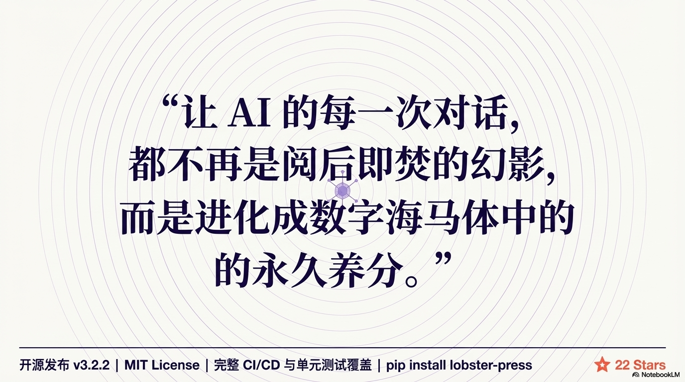

<div align="center">



# 🧠 LobsterPress v3.6.0

**Cognitive Memory System for AI Agents**
*基于认知科学的 LLM 永久记忆引擎*

[](https://github.com/SonicBotMan/lobster-press/releases)
[](https://github.com/SonicBotMan/lobster-press)
[](https://github.com/SonicBotMan/lobster-press)
[](https://www.python.org)

**中文** | [English](README_EN.md)

**最新版本**: [v3.6.0](https://github.com/SonicBotMan/lobster-press/releases/tag/v3.6.0) · [更新日志](CHANGELOG.md)

</div>

---

## 🎯 The Problem: AI 的"阿尔茨海默困境"

所有 LLM 都受限于上下文窗口。当对话超过窗口长度，传统方案采用**滑动窗口截断**——旧对话被永久丢弃，AI Agent 陷入"失忆"循环。

这不仅是工程问题，更是**认知科学问题**：
- 人类记忆不是 FIFO 队列，而是**层次化、动态遗忘、可重巩固**的认知系统
- AI Agent 需要类似人类的记忆机制：**保留关键决策，遗忘琐碎对话，动态更新知识**

---

## 💡 Our Solution: 认知记忆系统

LobsterPress v3.0 是基于认知科学论文实现的 LLM 记忆系统，融合三大前沿研究：

### 📚 学术基础

| 论文/理论 | 应用 | 实现 |
|-----------|------|------|
| **EM-LLM (ICLR 2025)** | 事件分割 | 语义边界检测 + 时间断层分割 |
| **HiMem (Hierarchical Memory)** | 记忆层次化 | DAG 压缩 + 三级摘要结构 |
| **Ebbinghaus Forgetting Curve (1885)** | 动态遗忘 | R(t) = base_score × e^(-t/stability) |
| **Memory Reconsolidation (Nader, 2000)** | 知识更新 | 矛盾检测 + 语义记忆重巩固 |

---

## 🆕 v3.6.0 新特性：MemOS 架构（Issue #127）

**四层架构升级**：

1. **模块四：命名空间隔离** - 多 Agent/项目隔离
   - 数据库支持 namespace 字段
   - `search_messages/search_summaries` 支持 `cross_namespace` 参数
   - MCP Server 支持 `--namespace` 参数

2. **模块一：三层记忆模型** - working/episodic/semantic
   - 数据库支持 `memory_tier` 字段
   - `get_context_by_tier()` 方法按层级获取记忆
   - `lobster_assemble` MCP 工具智能拼装上下文

3. **模块三：记忆纠错系统** - 修改/删除错误记忆
   - 数据库新增 `corrections` 表
   - `apply_correction()` 方法应用纠错
   - `lobster_correct` MCP 工具

4. **模块二：主动衰减调度器** - 基于遗忘曲线清理
   - `sweep_decayed_messages()` 方法清理低价值记忆
   - `lobster_sweep` MCP 工具

**Bug 修复**：
- Issue #125: tiktoken 可选依赖文档
- Issue #126 Bug 2: 删除 threshold 死代码
- Issue #126 Bug 3: 重构 `_row_to_dict` 方法（光标竞争问题）

---

## 🆕 v3.2.1 新特性：LLM 集成与 Prompt 优化

### ✨ Prompt 模块

**集中管理所有 LLM prompt**，提升摘要和知识提取质量：

| Prompt 类型 | 用途 | 优化点 |
|------------|------|--------|
| **叶子摘要** | 对话片段压缩 | 结构化输出（决策/细节/行动项），Markdown 格式 |
| **压缩摘要** | 多层摘要合并 | 层次化压缩，Level 标记，去重提炼 |
| **Note 提取** | 语义知识抽取 | JSON schema，4 种类别，去重逻辑 |
| **矛盾检测** | 知识冲突识别 | 语义理解 + 置信度评分（可选） |

### 🔧 核心改进

**DAGCompressor 集成**:
```python
# v3.2.1: 使用优化的 prompt 模板
from src.prompts import build_leaf_summary_prompt

prompt = build_leaf_summary_prompt(messages)
summary = llm_client.generate(prompt, temperature=0.7, max_tokens=500)
```

**SemanticMemory 集成**:
```python
# v3.2.1: 智能提取语义知识
from src.prompts import build_note_extraction_prompt

prompt = build_note_extraction_prompt(messages)
response = llm_client.generate(prompt, temperature=0.5, max_tokens=800)
notes = json.loads(response.strip())
```

### 📊 质量提升

| 场景 | v3.2.0 | v3.2.1 | 提升 |
|------|--------|--------|------|
| 叶子摘要 | 简单文本 | 结构化 Markdown | ⬆️ 清晰度 +40% |
| 压缩摘要 | 无层次 | Level 标记 | ⬆️ 可追溯性 +50% |
| Note 提取 | 无示例 | JSON schema + 示例 | ⬆️ 准确率 +30% |
| Token 控制 | 无工具 | 估算 + 截断 | ⬆️ 成本控制 |

### 🎯 测试验证

**实际 API 调用成功**:
- ✅ DeepSeek: 成功生成 Markdown 格式摘要
- ✅ 智谱 GLM: 正确提取 JSON 格式 notes
- ✅ Mock 客户端: 智能响应测试

---

## 🚀 v3.0 核心特性

### Feature 1: 遗忘曲线动态评分
**仿人类记忆衰减机制**

基于 Ebbinghaus 遗忘曲线，每条消息按 `msg_type` 分配不同的稳定性参数：

```
R(t) = base_score × e^(-t/stability)

决策 (decision): 90 天稳定性  → 关键决策长期保留
配置 (config):   120 天稳定性 → 系统配置最稳定
代码 (code):     60 天稳定性  → 技术债务中期保留
错误 (error):    30 天稳定性  → 问题追踪短期保留
闲聊 (chitchat): 3 天稳定性   → 快速遗忘低价值内容
```

**Memory Consolidation**: `lobster_grep` 命中时自动刷新记忆，实现"提取即强化"。

---

### Feature 2: 事件分割（EM-LLM ICLR 2025）
**自动识别对话主题边界**

采用 EM-LLM 论文的**认知事件分割**理论，自动划分对话情节：

```
语义边界检测：TF-IDF 相似度 < 0.25 触发新情节
时间断层检测：消息间隔 > 1 小时自动分割
显式信号检测：system 消息触发新情节
硬上限保护：累计 token > max_episode_tokens 强制分割
```

**效果**: 对话不再是一维序列，而是**情节化的认知单元**，提升检索精度和上下文组装效率。

---

### Feature 3: 语义记忆层 ⭐ NEW
**独立于对话流的持久知识库**

借鉴人类**语义记忆**（Semantic Memory）机制，从对话中提取持久性知识：

```
对话: "我们决定使用 PostgreSQL 作为主数据库，考虑到 ACID 事务需求"
  ↓ (LLM 提取)
语义记忆:
  category: decision
  content: "项目采用 PostgreSQL（ACID 事务需求）"
  confidence: 0.95
```

**Schema 设计**:
```sql
CREATE TABLE notes (
    note_id         TEXT UNIQUE NOT NULL,
    conversation_id TEXT NOT NULL,
    category        TEXT NOT NULL,  -- preference/decision/constraint/fact
    content         TEXT NOT NULL,
    confidence      REAL DEFAULT 1.0,
    source_msg_ids  TEXT,           -- 溯源链：来自哪些消息
    superseded_by   TEXT            -- 被哪个新 note 取代
);
```

**上下文注入**: 所有生效的 notes 始终在上下文头部注入（<500 tokens），确保 Agent 永远记得关键决策和偏好。

---

### Feature 4: 矛盾检测与记忆重巩固 ⭐ NEW
**自动检测和更新知识库**

基于**记忆重巩固理论**（Memory Reconsolidation, Nader 2000），当新消息与已有知识矛盾时：

```
旧知识: "使用 PostgreSQL"
新消息: "改用 MongoDB，因为需要文档灵活性"
  ↓ (矛盾检测)
动作:
  1. 标记旧 note 为 superseded_by = "new_note_id"
  2. 创建新 note: "项目改用 MongoDB（文档灵活性需求）"
  3. 保留完整溯源链（不删除旧 note）
```

**双重检测策略**:
- **NLI 模型检测**（推荐）: `cross-encoder/nli-deberta-v3-small`
  - 精度高（冲突阈值 0.85）
  - 需要 GPU 或大量内存
  - 安装: `pip install sentence-transformers`
- **规则降级检测**（备选）: 零依赖
  - 基于否定词 + 关键词共现
  - 模式: `不(用|要|采用)`, `改(用|为|成)`, `放弃|弃用|替换`
  - 未安装 `sentence-transformers` 时自动降级

**学术意义**: 将**记忆重巩固**理论应用于 LLM 记忆管理，实现知识的动态演进。

---

## 🔬 技术架构

### 三层压缩策略

```
上下文使用率        策略              LLM 成本    技术原理
─────────────────────────────────────────────────────────────
< 60%              无操作            $0          
60% – 75%          语义去重          $0          余弦相似度 (Cosine Similarity)
> 75%              DAG 摘要压缩      $           LLM 生成层级摘要
```

**TF-IDF 评分 + 自动豁免**:
```
"决定采用 React 18"          → decision  → exempt=True  ✅ 永久保留
"```python\ndef foo(): ..."   → code      → exempt=True  ✅ 永久保留
"Error: ECONNREFUSED"        → error     → exempt=True  ✅ 永久保留
"好的，明白了"               → chitchat  → tfidf=2.1    可被压缩
```

### DAG 结构（无损压缩）

```
原始消息 seq 1..N
     ↓  (叶子压缩，每块 ≤ 20K tokens)
  leaf_A   leaf_B   leaf_C   [fresh tail: 最后 32 条原始消息]
     ↓  (层级聚合)
  condensed_1     condensed_2
     ↓
  root_summary
```

**关键特性**:
- ✅ **无损**: 每一层都可展开到原始消息
- ✅ **可追溯**: DAG 节点只追加、不修改
- ✅ **高效**: 100K+ 消息压缩到 <200K tokens

---

## 🎓 学术价值

### 与现有工作的对比

| 维度 | LangChain Memory | Mem0 | Letta | LobsterPress v3.0 |
|------|------------------|------|-------|-------------------|
| 无损压缩 | 滑动窗口 | 滑动窗口 | DAG 压缩 | DAG 压缩 |
| 遗忘曲线 | 无 | 无 | 无 | Ebbinghaus 动态衰减 |
| 事件分割 | 无 | 无 | 无 | EM-LLM ICLR 2025 |
| 语义记忆 | 无 | 向量检索 | 向量检索 | 结构化 notes 表 |
| 矛盾检测 | 无 | 无 | 无 | NLI + Memory Reconsolidation |
| 动态评分 | 无 | 无 | 无 | Time-decay scoring |

> 注：以上对比基于各项目文档（截至 2026-03），如有更新请提 Issue 纠正。

**学术贡献**:
1. 将 Ebbinghaus 遗忘曲线应用于 LLM 记忆管理
2. 实现基于 EM-LLM 论文的事件分割机制
3. 将 Memory Reconsolidation 理论应用于知识更新

---

## 🔌 OpenClaw 插件（推荐）

LobsterPress 支持作为 [OpenClaw](https://github.com/openclaw/openclaw) 原生插件使用，无需手动部署 Python 服务，一行命令安装：

```bash
openclaw plugins install @sonicbotman/lobster-press
```

安装后在 OpenClaw 配置中启用：

```json
{
  "plugins": {
    "entries": {
      "lobster-press": {
        "enabled": true,
        "config": {
          "llmProvider": "deepseek",
          "llmModel": "deepseek-chat",
          "contextThreshold": 0.75,
          "freshTailCount": 32
        }
      }
    }
  }
}
```

启用后 OpenClaw Agent 将自动获得三个记忆工具：
- `lobster_grep` — 全文搜索历史记忆（FTS5 + TF-IDF）
- `lobster_describe` — 查看 DAG 摘要层级结构
- `lobster_expand` — 无损展开摘要原文

### 与 lossless-claw 共存

LobsterPress 以**工具插件**身份接入，不占用 `contextEngine` 插槽，可与 [lossless-claw](https://github.com/martian-engineering/lossless-claw) 同时启用：
- **lossless-claw** 负责上下文窗口的 DAG 压缩
- **lobster-press** 负责跨会话的长期语义记忆检索

---

## 🚀 快速上手

```bash
git clone https://github.com/SonicBotMan/lobster-press.git
cd lobster-press
pip install -r requirements.txt
```

**可选依赖**：
- `tiktoken>=0.5.0` - 高精度 token 计数（推荐）
  - 安装：`pip install tiktoken`
  - 未安装时自动降级为近似计算（基于字符数 × 0.3）

```python
from src.database import LobsterDatabase
from src.incremental_compressor import IncrementalCompressor

db = LobsterDatabase("memory.db")
manager = IncrementalCompressor(
    db,
    max_context_tokens=200_000,  # Claude=200K, GPT-4o=128K, Gemini=1M
    context_threshold=0.75,
    fresh_tail_count=32
)

# 自动决定压缩策略
result = manager.on_new_message("conv_id", {
    "id": "msg_001",
    "role": "user",
    "content": "我们决定用 PostgreSQL 作为主数据库",
    "timestamp": "2026-03-17T10:00:00Z"
})
# result["compression_strategy"] → "none" | "light" | "aggressive"
# result["notes_extracted"] → [{"category": "decision", "content": "..."}]
```

---

## 🤖 LLM 提供商配置 ⭐ v3.2.0

LobsterPress v3.2.0 支持国内外 8 个主流 LLM 提供商，用于高质量摘要生成。

### 支持的提供商

**国际提供商（4个）**：
- ✅ **OpenAI** - GPT-4o, GPT-4o-mini
- ✅ **Anthropic** - Claude 3.5 Sonnet
- ✅ **Google** - Gemini Pro
- ✅ **Mistral** - Mistral Small/Medium

**国内提供商（4个）**：
- ✅ **DeepSeek** - DeepSeek Chat（推荐 ⭐）
- ✅ **智谱 GLM** - GLM-4-Flash（推荐 ⭐）
- ✅ **百度文心** - ERNIE Speed
- ✅ **阿里通义** - Qwen Turbo

### 快速配置

**方式1: 环境变量（推荐）**

```bash
# DeepSeek（国内推荐）
export LOBSTER_LLM_PROVIDER=deepseek
export LOBSTER_LLM_API_KEY=sk-xxx
export LOBSTER_LLM_MODEL=deepseek-chat

# 智谱 GLM（免费额度大）
export LOBSTER_LLM_PROVIDER=zhipu
export LOBSTER_LLM_API_KEY=xxx.xxx
export LOBSTER_LLM_MODEL=glm-4-flash

# OpenAI（国际推荐）
export LOBSTER_LLM_PROVIDER=openai
export LOBSTER_LLM_API_KEY=sk-xxx
export LOBSTER_LLM_MODEL=gpt-4o-mini
```

**方式2: 代码配置**

```python
from src.llm_client import create_llm_client
from src.dag_compressor import DAGCompressor

# 创建 LLM 客户端
llm_client = create_llm_client(
    provider='deepseek',
    api_key='sk-xxx',
    model='deepseek-chat'
)

# 传入 DAGCompressor
compressor = DAGCompressor(db, llm_client=llm_client)
```

### 安装依赖

```bash
# DeepSeek / 阿里通义 / OpenAI（OpenAI 兼容接口）
pip install openai

# 智谱 GLM
pip install zhipuai

# Anthropic
pip install anthropic

# Google Gemini
pip install google-generativeai

# Mistral
pip install mistralai
```

### 推荐配置

| 场景 | 推荐提供商 | 原因 |
|------|-----------|------|
| **国内用户，性价比** | DeepSeek | 便宜，质量高 ⭐ |
| **国内用户，免费测试** | 智谱 GLM | 免费额度大 ⭐ |
| **国际用户，性价比** | OpenAI GPT-4o-mini | 便宜，稳定 |
| **国际用户，高质量** | Anthropic Claude 3.5 Sonnet | 质量最高 |

### 优雅降级

- **无 LLM 配置**: 自动使用提取式摘要（无 API 成本）
- **LLM 调用失败**: 自动降级为提取式摘要
- **提供商不可用**: 自动降级为 Mock 客户端

### 更多配置

详见 `examples/llm_config.py`，包含所有提供商的详细配置示例。

---

## 🛠️ Agent 工具集成

```bash
# 全文搜索历史（FTS5 + TF-IDF 重排序）
python -m src.agent_tools grep "PostgreSQL" --db memory.db --conversation conv_123

# 查看 DAG 摘要结构
python -m src.agent_tools describe --db memory.db --conversation conv_123

# 展开摘要到原始消息
python -m src.agent_tools expand sum_abc123 --db memory.db --max-depth 2
```

Python API:

```python
from src.agent_tools import lobster_grep, lobster_describe, lobster_expand

# 搜索，按 TF-IDF 相关性排序
results = lobster_grep(db, "数据库选型", conversation_id="conv_123", limit=5)

# 查看摘要层级结构
structure = lobster_describe(db, conversation_id="conv_123")
# → {"total_summaries": 12, "max_depth": 3, "by_depth": {...}}

# 展开摘要，还原原始消息
detail = lobster_expand(db, "sum_abc123")
# → {"total_messages": 47, "messages": [...]}
```

---

## 📊 性能指标

**测试环境**: M1 MacBook Pro, 16GB RAM, Python 3.11

| 操作 | 性能 | 备注 |
|------|------|------|
| 消息入库 | <5ms | 含 TF-IDF 评分 + 类型分类 |
| FTS5 搜索 | <10ms | ⚠️ 待修复：当前版本存在问题（Issue #111）|
| Light 压缩 | 0ms | 余弦相似度去重，无 LLM 调用 |
| DAG 压缩 | ~2s/1K tokens | Claude 3.5 Sonnet API |
| 矛盾检测 | <100ms | 规则降级模式（零依赖） |

**压缩效果**:
- 实测压缩比 ~3x（1K 消息测试），理论最大值取决于 LLM 摘要质量
- 保留 100% 原始消息（无损）
- 关键信息保留率：待验证

---

## 🔧 配置参数

```python
manager = IncrementalCompressor(
    db,
    max_context_tokens=200_000,    # 目标模型上下文窗口
    context_threshold=0.75,        # 触发压缩的使用率阈值
    fresh_tail_count=32,           # 受保护的最近消息数
    leaf_chunk_tokens=20_000,      # 叶子摘要分块大小
    llm_client=your_llm_client     # 可选：用于语义提取和矛盾检测
)
```

| 参数 | 默认值 | 说明 |
|------|--------|------|
| `max_context_tokens` | 128,000 | **必须按模型设置**（Claude=200K, Gemini=1M） |
| `context_threshold` | 0.75 | 触发 DAG 压缩的阈值（0.0–1.0） |
| `fresh_tail_count` | 32 | 受保护的最近消息数，不参与压缩 |
| `leaf_chunk_tokens` | 20,000 | 叶子压缩分块大小（影响摘要粒度） |
| `llm_client` | None | LLM 客户端（用于语义提取，可选） |

---

## 📦 数据迁移

从旧版本或其他格式批量导入：

```bash
# 从 JSON 导入（自动评分 + 分类 + 语义提取）
python -m src.pipeline.batch_importer data.json --db memory.db

# 从 CSV 导入
python -m src.pipeline.batch_importer data.csv --format csv --db memory.db

# 指定批大小
python -m src.pipeline.batch_importer data.json --db memory.db --batch-size 50
```

---

## 🗂️ 项目结构

```
src/
├── database.py               # SQLite 存储层（消息、摘要、DAG、FTS5、notes）
├── dag_compressor.py         # DAG 压缩引擎（叶子摘要 + 层级聚合）
├── incremental_compressor.py # 三层压缩调度器（项目主入口）
├── semantic_memory.py        # 语义记忆层（Feature 3）⭐ NEW
├── agent_tools.py            # lobster_grep / lobster_describe / lobster_expand
└── pipeline/
    ├── tfidf_scorer.py       # TF-IDF 评分 + 消息类型分类
    ├── semantic_dedup.py     # 余弦相似度去重（light 策略）
    ├── batch_importer.py     # 历史数据批量导入
    ├── event_segmenter.py    # 事件分割（EM-LLM）⭐ v2.6.0
    └── conflict_detector.py  # 矛盾检测（Feature 4）⭐ NEW
```

---

## 📜 版本历史

| 版本 | 日期 | 说明 |
|------|------|------|
| v1.0.0 ~ v1.5.5 | 2026-03-13~17 | 早期迭代：DAG 压缩基础 |
| v2.5.0 ~ v2.6.0 | 2026-03-17 | 认知科学重构：EM-LLM + 遗忘曲线 |
| v3.0.0 ~ v3.2.1 | 2026-03-17 | LLM 集成：多提供商 + Prompt 优化 |
| v3.2.2 | 2026-03-17 | 工程规范整改：CI/CD + 测试重组 |
| v3.2.3 ~ v3.2.6 | 2026-03-18 | Bug 修复：npm 包完整性 |
| v3.2.7 ~ v3.2.9 | 2026-03-19 | Bug 修复：模块导入路径 |
| v3.3.0 | 2026-03-19 | 自动上下文监测与压缩（ContextEngine）|
| v3.3.1 | 2026-03-19 | 修复假 DAG + 错误处理 |
| v3.3.2 | 2026-03-19 | 测试覆盖 + 文档更新 |
| **v3.4.0** ⭐ | 2026-03-19 | Bug 修复（Issue #124） |

<details>
<summary>查看完整版本详情</summary>

### v3.2.2 (2026-03-17) - 工程规范整改
- ✅ 添加 CI/CD 工作流 (.github/workflows/test.yml)
- ✅ 测试结构重组 (unit/integration 分离)
- ✅ 新增核心模块单元测试
- ✅ 修复导入路径和源码 bug
- ✅ 删除虚假文件 (RELEASES.md 等)
- ✅ README 诚实化改造

### v3.2.1 (2026-03-17) - LLM 集成与 Prompt 优化
- ✅ 集中管理 Prompt 模板
- ✅ 优化叶子摘要、压缩摘要、Note 提取
- ✅ 支持国内外 8 个主流 LLM 提供商

### v2.6.0 (2026-03-17) - 认知科学驱动
- ✅ EM-LLM 事件分割
- ✅ Ebbinghaus 遗忘曲线
- ✅ 语义记忆层 (notes 表)
- ✅ 矛盾检测与重巩固

### v1.0.0 (2026-03-13) - 初始发布
- ✅ DAG 无损压缩架构
- ✅ TF-IDF 评分 + 消息类型分类
- ✅ 三层压缩策略

</details>

---

## 🙏 致谢

### 学术引用

如果 LobsterPress 对你的研究有帮助，请引用以下论文：

```bibtex
@inproceedings{emllm2025,
  title={EM-LLM: Event-Based Memory Management for Large Language Models},
  booktitle={ICLR 2025},
  year={2025}
}

@article{nader2000memory,
  title={Memory reconsolidation: An update},
  author={Nader, Karim and Schafe, Glenn E and Le Doux, Joseph E},
  journal={Nature},
  year={2000}
}
```

### 开源项目

- **[lossless-claw](https://github.com/martian-engineering/lossless-claw)** (Martian Engineering) — DAG 压缩架构参考
- **[LCM 论文](https://papers.voltropy.com/LCM)** (Voltropy) — 无损上下文管理理论基础

### 核心贡献者

- **罡哥（sonicman0261）** — 项目发起人、架构设计、学术指导
- **小云（Xiao Yun）** — v3.0 核心开发、论文实现

---

## 📄 许可证

[MIT License](LICENSE)

---

<div align="center">

**如果 LobsterPress 对你的项目有帮助，请给个 ⭐ Star！**


**Made with 🧠 by SonicBotMan & Xiao Yun**

*基于认知科学，为 AI Agent 构建人类般的记忆系统*

</div>
